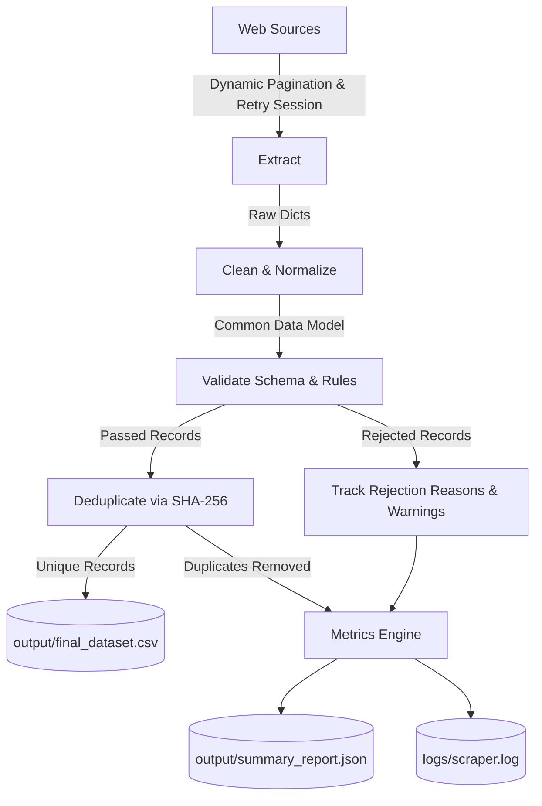

# Web Scraping & ETL Data Pipeline

**Production-grade Web Scraping and ETL Data Pipeline for Realisieren Technologies (NxtWave) Take-Home Technical Assessment.**

---

## 1. Project Overview

This project implements an end-to-end, resilient ETL (Extract, Transform, Load) data pipeline in Python that extracts data from multiple online sources, normalizes heterogeneous records into a unified Common Data Model (CDM), performs strict data contract validation, filters duplicates via SHA-256 content fingerprinting, and consolidates clean data into analytics-ready artifacts.

### Data Sources
1. **Books to Scrape** (`https://books.toscrape.com/`)
   - 50 paginated catalogue pages (1,000 total books).
   - Extracted fields: `title`, `price`, `rating`, `availability`, `category` (if available), and `detail URL`.
2. **Quotes to Scrape** (`https://quotes.toscrape.com/`)
   - 10 paginated quote pages (100 total quotes).
   - Extracted fields: `quote text`, `author`, `tags`, and `quote URL`.

---

## 2. Directory Structure

```text
scraping_assignment/
├── scrapers/
│   ├── __init__.py           # Scrapers package exports
│   ├── base_scraper.py       # Resilient session, retry logic, rate limiting
│   ├── books_scraper.py      # Dynamic pagination & parsing for Books to Scrape
│   └── quotes_scraper.py     # Dynamic pagination & parsing for Quotes to Scrape
├── processing/
│   ├── __init__.py           # Processing package exports
│   ├── cleaning.py           # Whitespace, price, rating, tag, and URL normalizers
│   ├── validation.py         # Schema verification & rejection reason tracking
│   └── deduplication.py      # SHA-256 entity fingerprinting & deduplication
├── tests/
│   ├── __init__.py
│   ├── test_cleaning.py      # Unit tests for text, price, rating, tag cleaning
│   ├── test_validation.py    # Unit tests for contract checks & rejection reasons
│   └── test_deduplication.py # Unit tests for SHA-256 fingerprinting & deduplication
├── output/
│   ├── final_dataset.csv     # Clean, unique consolidated dataset (1,099 rows)
│   └── summary_report.json   # Detailed pipeline metrics & execution report
├── logs/
│   └── scraper.log           # File log tracking requests, pages, and warnings
├── main.py                   # Orchestration CLI entrypoint
├── requirements.txt          # Production dependencies
├── README.md                 # Complete technical documentation
└── AI_USAGE.md               # Transparency report on AI assistance & interview prep
```

---

## 3. Python Version & Environment Setup

- **Python Version**: Python 3.10+ (tested on Python 3.10.4).
- **Core Dependencies**:
  - `requests` (>= 2.28.0)
  - `beautifulsoup4` (>= 4.11.0)
  - `urllib3` (>= 1.26.0)
  - `pytest` (>= 7.0.0)

### Installation

```bash
# Clone or navigate to the project directory
cd scraping_assignment

# (Optional) Create and activate a virtual environment
python -m venv venv
# Windows:
venv\Scripts\activate
# Linux/macOS:
source venv/bin/activate

# Install required dependencies
pip install -r requirements.txt
```

---

## 4. How to Run

### Execute the Complete Pipeline
```bash
python main.py
```
This runs extraction across both sources with a polite 0.5s delay, cleans all records, validates schemas, deduplicates, and generates:
- `output/final_dataset.csv`
- `output/summary_report.json`
- `logs/scraper.log`

### CLI Options & Custom Configurations
```bash
# Scrape only books
python main.py --source books

# Scrape only quotes
python main.py --source quotes

# Customize polite delay (e.g., 1.0 second) and request timeout
python main.py --delay 1.0 --timeout 15.0

# Enable verbose DEBUG logging to console
python main.py --verbose

# Custom output directory or log file
python main.py --output-dir custom_output/ --log-file custom_logs/run.log
```

---

## 5. Automated Tests

Run the complete unit test suite using `pytest`:

```bash
pytest tests -v
```

All 55 unit tests cover:
- Collapsing multiple spaces, newlines, tabs, and non-breaking spaces (`\xa0`).
- Stripping smart curly quotes (`“”‘’`), guillemets (`«»`), and straight quotes (`""`, `''`).
- Parsing currency strings (`£51.77`, `$19.99`, `€120.50`, negative values, invalid strings).
- Converting rating words (`'One'`..`'Five'`, case-insensitively) and numeric values.
- Cleaning, sorting alphabetically, and semicolon-joining tag lists and strings.
- Resolving relative URLs to full HTTP/HTTPS format with `urljoin`.
- Schema validation, required fields, URL syntax, negative prices, and rating range checks.
- Tracking multiple rejection reasons simultaneously.
- SHA-256 fingerprint generation handling whitespace, punctuation stripping, case folding, and first-50-character truncation for quotes.

---

## 6. Architecture & ETL Pipeline



### 1. Extraction & Dynamic Pagination
- **Zero Hardcoded Page Ranges**: Paginates dynamically by selecting `li.next > a`.
- **URL Resolution**: Uses `urllib.parse.urljoin(current_url, next_href)` to resolve relative links (e.g., `catalogue/page-2.html`, `page-3.html`, `/page/2/`).
- **Termination**: Loops until `li.next > a` is absent (Page 50 for Books, Page 10 for Quotes).

### 2. Politeness & Network Resilience
- **Polite Delays**: Enforces a non-blocking `0.5s` delay between successive requests to prevent server throttling.
- **Urllib3 Retry Strategy**:
  - `requests.Session` mounted with `HTTPAdapter`.
  - Backoff factor of `0.5s` with up to 3 retry attempts.
  - Retries status codes: `[429, 500, 502, 503, 504]`.
  - Restricted to safe/idempotent HTTP methods: `["HEAD", "GET", "OPTIONS"]`.
- **Timeouts**: Every network request specifies a `10.0s` timeout to eliminate hanging sockets.
- **Custom User-Agent**: Identifies the pipeline with standard browser compatibility headers.

### 3. Common Data Model (CDM)
Heterogeneous sources are consolidated into a standardized 9-column schema:

| Column | Type | Description | Books Example | Quotes Example |
|---|---|---|---|---|
| `source` | `str` | Identifying source name | `"books"` | `"quotes"` |
| `source_url` | `str` | Normalized full HTTP/HTTPS URL | `https://books.toscrape.com/.../a-light-in-the-attic_1000/index.html` | `https://quotes.toscrape.com/` |
| `name_or_title`| `str` | Book title or quote text | `"A Light in the Attic"` | `"The world as we have created it..."` |
| `category` | `str` / `None` | Product category (if available) | `None` / `"Poetry"` | `None` |
| `price` | `float` / `None` | Clean numeric price (float) | `51.77` | `None` |
| `rating` | `int` / `None` | Integer rating between 1 and 5 | `3` | `None` |
| `author` | `str` / `None` | Author name | `None` | `"Albert Einstein"` |
| `tags` | `str` / `None` | Alphabetical semicolon-joined tags | `None` | `"change;deep-thoughts;thinking;world"` |
| `scraped_at` | `str` | ISO 8601 UTC timestamp | `"2026-10-07T12:34:59.624706+00:00"` | `"2026-10-07T12:36:00.261350+00:00"` |

> **Design Principle**: Non-applicable fields remain strictly `None` (empty in CSV). Fake placeholder values (e.g. `0` for quote price) are never introduced.

### 4. Cleaning & Transformations (`processing/cleaning.py`)
- **Whitespace Normalization**: Converts non-breaking spaces (`\xa0`), tabs, and newlines into single spaces; strips leading/trailing spaces.
- **Quote Stripping**: Removes smart quotes (`“”‘’`), guillemets (`«»`), and straight quotes (`""`, `''`) from quote texts while preserving internal apostrophes.
- **Price Cleaning**: Strips currency glyphs (`£`, `$`, `€`), extracts numeric patterns, and casts to `float`.
- **Rating Conversion**: Maps word strings (`'One'`, `'Two'`, `'Three'`, `'Four'`, `'Five'`) case-insensitively to integers `1..5`.
- **Tag Normalization**: Lowercases, deduplicates, sorts alphabetically, and joins with semicolons (`;`).
- **URL Normalization**: Fully resolves paths to absolute HTTP/HTTPS addresses.

### 5. Validation & Rejection Tracking (`processing/validation.py`)
Each cleaned record must satisfy five contract rules:
1. `source`: Must be present in `{"books", "quotes"}`.
2. `name_or_title`: Must be non-empty string.
3. `source_url`: Must parse with valid `http`/`https` scheme and non-empty domain.
4. `price`: If present, must be numeric and `>= 0.0`.
5. `rating`: If present, must be an integer between 1 and 5.

Rejection reasons are logged to `logs/scraper.log` as `WARNING` and tabulated in `output/summary_report.json`.

### 6. Deduplication & SHA-256 Fingerprinting (`processing/deduplication.py`)
To prevent duplicates arising from site redundancies:
- **Books Fingerprint**: `SHA256("books:" + normalized_title)`
  - Punctuation stripped, lowercase, collapsed spaces.
- **Quotes Fingerprint**: `SHA256("quotes:" + normalized_author + ":" + normalized_quote[:50])`
  - Normalized author and first 50 characters of quote text.
- **Duplicate Handling**: Retains the first occurrence, isolates duplicate records, and logs duplicate metrics.

### 7. Fault Isolation
Scrapers execute inside isolated `try/except` blocks in `main.py`. A network drop or unexpected failure on Books will not abort Quotes scraping; partial batches are preserved and logged.

---

## 7. Pipeline Execution Results

From the live execution:
- **Books Scraped**: 50 pages visited, 1,000 raw book records.
- **Quotes Scraped**: 10 pages visited, 100 raw quote records.
- **Total Raw Records**: 1,100 records.
- **Total Valid Records**: 1,100 records (0 schema rejections).
- **Duplicates Identified**: 1 duplicate book (*"The Star-Touched Queen"* is listed on both page 19 and page 20 of Books to Scrape).
- **Final Clean Unique Records**: 1,099 records saved to `output/final_dataset.csv`.
- **Duration**: ~72 seconds (respecting 0.5s delay across all 60 HTTP requests).

---

## 8. Assumptions & Known Limitations

1. **Category on Books Catalogue**: The main catalogue listing pages (`/catalogue/page-X.html`) do not embed individual book categories in `article.product_pod`. Following the prompt specification (`category (if available)` and "do not invent fake values"), `category` is set to `None` on main catalogue pages rather than triggering 1,000 additional detail requests (which would add ~500s of crawling delay).
2. **Quote Source URLs**: Quotes to Scrape provides author biography URLs rather than unique per-quote permalinks. The `source_url` for quotes corresponds to the exact page URL where the quote was encountered.
3. **Static HTML vs JavaScript**: Both target sites are statically rendered HTML, allowing fast and reliable extraction with `requests` + `BeautifulSoup` without headless browser overhead.
